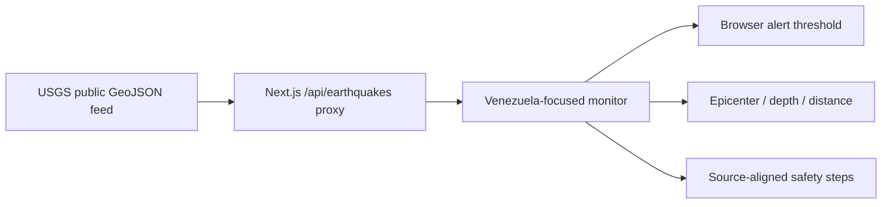

# PHOENIX Seismo

**A Venezuela-focused earthquake monitor built for the moments after shaking begins.**

PHOENIX Seismo turns the public, real-time USGS earthquake feed into a focused view for Venezuela and nearby waters: magnitude, time, depth, epicenter coordinates, event status, a schematic map, optional local distance, and short safety actions.

It is not an earthquake prediction system, government warning authority, emergency dispatcher, or tsunami warning source. It makes the available seismic data clearer and more actionable without pretending it can replace official alerts.

## What works now

- A live server-side proxy to the official USGS GeoJSON feed, refreshed every minute.
- A Venezuela-centered monitoring window: 0–14°N and 74–57°W.
- Recent event cards with magnitude, depth, epicenter, time in Venezuela, review status, and a direct USGS event link.
- Optional on-device distance calculation. Location stays in the browser and is never sent to PHOENIX or USGS.
- Native browser notifications for a user-selected magnitude threshold while the tab or installed app is open.
- A schematic epicenter view and fixed, source-aligned safety actions for shaking, damaged structures, and coastal conditions.

## Alert boundary

Browser alerts require permission and work while PHOENIX is open or installed and active. A true background push-warning network would require formal authorization, a maintained push infrastructure, and direct integration with the responsible Venezuelan authorities. PHOENIX does not claim to provide that.

## Data and safety

USGS documents that its real-time GeoJSON feeds update every minute and are intended for programmatic earthquake information displays. Events may be preliminary and later revised. PHOENIX shows the event status and keeps a direct source link visible. Follow official Venezuelan authorities in an emergency.

## Run locally

Node.js 20+ and npm are required. There is no OpenAI API, paid API, user account, or secret.

```bash
npm install
npm run dev
```

```bash
npm run lint
npm run typecheck
npm test
npm run build
npm run test:e2e
```

## Architecture



The proxy has no user query parameters and no API key. It fixes the geographic bounds, event type, magnitude floor, time window, and cache lifetime on the server.

## Codex and GPT-5.6 contribution

Codex and GPT-5.6 were core development collaborators during OpenAI Build Week. They helped replace an unfocused humanitarian dashboard with a testable Venezuela seismic-monitoring product; research the primary USGS API; design the safety and alert boundaries; implement the route handler, monitor, tests, and PWA cache strategy; and run build/browser checks.

The production monitor deliberately has no OpenAI runtime dependency. Codex and GPT-5.6 helped create it; people seeking earthquake information should not need an API key or paid model call.

See [DEVPOST.md](DEVPOST.md) for the submission story and demo script. Source code is MIT-licensed.
