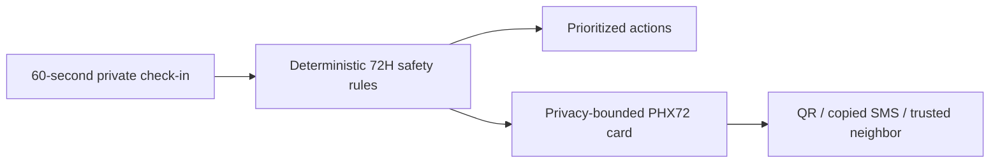

# PHOENIX 72H

**An offline continuity card for the first 72 hours after an earthquake.**

PHOENIX 72H is a private, browser-based tool for a person or household whose phone may be their only remaining record after an earthquake. In about a minute it identifies structural danger, interrupted medication, maternal/infant care, and unsafe water; then produces a small, readable handoff card that can be copied into an SMS or carried as a QR code.

It is intentionally not a dashboard, aid-allocation system, facility directory, or emergency dispatcher. It never claims a clinic is open or that rescuers are coming.

## The problem it addresses

After the Venezuela earthquakes, reports highlighted not only traumatic injuries but also disrupted chronic treatment, maternal and infant care, and water-related illness. A household often needs to communicate these priorities with a dying battery, no mobile data, and no safe reason to disclose its precise location.

PHOENIX makes that handoff legible without a login, cloud record, or paid model call.

## How it works



- **Red:** someone is trapped or a building is unsafe.
- **Amber:** treatment may run out, maternal/infant continuity is needed, or drinking water is uncertain.
- **Green:** aftershock readiness and a protected continuity record.
- **Offline handoff:** `PHX72` encodes only broad area, household count, safety, medication window, care flags, and water state. It contains no name, exact location, phone number, diagnosis, or account.
- **Private persistence:** the card stays in the browser after a reload and can be erased with one button.

The rules engine is deterministic and inspectable in [`domain/continuity/index.ts`](domain/continuity/index.ts). This is deliberate: in a high-stakes, low-connectivity moment, a user should not have to trust an opaque remote model to decide whether a person needs help.

## Safety boundaries

- PHOENIX is not medical advice, emergency dispatch, or a substitute for official instructions.
- In immediate danger, ask a nearby person to contact available emergency services.
- The water figure is the Sphere **planning reference** of 15 L/person/day, not a guarantee of supply or a clinical prescription.
- Never rely on the app as proof that a health facility, shelter, responder, or supply is available.

## Run locally

Requires Node.js 20+ and npm. No API key, account, backend, or paid service is needed.

```bash
npm install
npm run dev
```

```bash
npm run lint
npm run typecheck
npm test
npm run build
npm run test:e2e
```

## Evidence

The product framing is based on post-earthquake health continuity, water safety, and structural safety guidance from [PAHO/WHO](https://www.paho.org/en/emergencies), [WHO household water guidance](https://www.who.int/publications/m/item/household-water-treatment-and-safe-storage-following-emergencies-and-disasters), [CDC earthquake safety guidance](https://www.cdc.gov/earthquakes/safety/stay-safe-after-an-earthquake.html), and the [Sphere Handbook](https://spherestandards.org/handbook/). The app limits itself to stable, source-aligned actions rather than presenting unverified live operational data.

## Codex and GPT-5.6 contribution

PHOENIX 72H was meaningfully redesigned during OpenAI Build Week with Codex and GPT-5.6 as core development collaborators. They helped challenge the original dashboard approach, research the emergency context, design the privacy boundary and offline rules engine, implement the experience, and verify lint, type, unit, build, and browser/offline tests.

The production path deliberately has **no OpenAI API dependency**. Codex and GPT-5.6 helped build and validate the product; an earthquake survivor should not need credits, an API key, or a working connection to use its core function.

See [`DEVPOST.md`](DEVPOST.md) for the submission story and demo script. The source is MIT-licensed; see [`LICENSE`](LICENSE).
