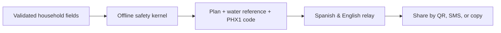

# PHOENIX Aid

**A disaster-ready household lifeline for Venezuela that works offline.**

PHOENIX Aid helps a household act and communicate during an earthquake or humanitarian emergency when connectivity is limited, location is sensitive, and time is scarce. It is a consumer safety tool—not a coordination dashboard, emergency dispatch system, or medical authority.

## What it does

- Builds an ordered, source-attributed household action plan on the device.
- Calculates a transparent minimum-water planning reference.
- Creates a compact `PHX1` request that fits in an SMS or QR code.
- Sorts mapped facilities by distance locally, never claiming they are open or available.
- Produces a Spanish and English relay from the exact plan fields, with no account, API key, name, free-form note, or exact coordinate.
- Keeps the plan, guide, request, and relay usable after the app has been loaded once and connectivity is lost.

## Why the relay is trustworthy

PHOENIX does not ask a language model to decide what is true in an emergency. The message is assembled locally from a small allowlist of visible, validated fields: broad area, household size, need categories, and structural-risk flag. The same facts are shown in the plan, encoded in the request, and used in the bilingual relay.



This design keeps critical guidance deterministic, inspectable, and available in the conditions where people may need it most.

## Privacy and safety boundaries

- No user account or personal identifier is required.
- Location is optional, processed in the browser, and never sent to PHOENIX or placed in a request.
- The request contains no name, diagnosis, or precise coordinate.
- Nothing is automatically dispatched.
- A mapped OpenStreetMap point is not presented as an open, safe, staffed, or available facility.
- PHOENIX does not diagnose or replace emergency services, official instructions, or qualified human judgment.

## Run locally

Requirements: Node.js 20+ and npm. No API key or paid service is needed.

```bash
npm install
npm run dev
```

Validation:

```bash
npm run lint
npm run typecheck
npm test
npm run build
npm run test:e2e
```

## Architecture

- `domain/pocket/`: deterministic plan, water reference, compact request, and local distance calculation.
- `domain/relay/`: allowlisted relay schema, bilingual message builder, and payload-integrity checks.
- `data/normalized/`: reviewed, app-ready facility data.
- `public/sw.js`: offline app shell and previously visited resources.
- `tests/`: unit, data-pipeline, browser-flow, and offline-reload checks.

## Evidence

Safety content is traceable in the app to [PAHO/WHO's Venezuela health recovery update](https://www.paho.org/es/noticias/14-7-2026-respuesta-sanitaria-al-terremoto-venezuela-entra-fase-recuperacion-temprana), [CDC post-earthquake guidance](https://www.cdc.gov/earthquakes/safety/stay-safe-after-an-earthquake.html), [WHO household-water guidance](https://www.who.int/publications/m/item/household-water-treatment-and-safe-storage-following-emergencies-and-disasters), and the [Sphere Handbook](https://spherestandards.org/handbook/). Facility points are derived from OpenStreetMap and retain their original attribution and licensing.

## Codex and GPT-5.6 contribution

PHOENIX was meaningfully extended during OpenAI Build Week with Codex and GPT-5.6 as core development collaborators. They were used to challenge the original dashboard concept, research primary humanitarian sources, design the offline-first household workflow, implement and refactor the application and data pipeline, and run unit, build, browser, mobile, and offline checks.

The final runtime deliberately has no paid model dependency. In a disaster-facing product, the essential path must still work when an API key, connectivity, or a remote model is unavailable. The public submission documents this decision transparently and includes the required Codex `/feedback` Session ID.

## Hackathon scope

The meaningful Build Week extension includes the offline household safety kernel, privacy-safe SMS/QR protocol, local proximity calculation, PWA behavior, bilingual relay, evidence surface, and automated validation. See [DEVPOST.md](DEVPOST.md) for the ready-to-submit story, video script, and checklist.

## License

PHOENIX source code is released under the MIT License. Third-party datasets, source documents, names, and trademarks remain under their respective licenses and terms.
